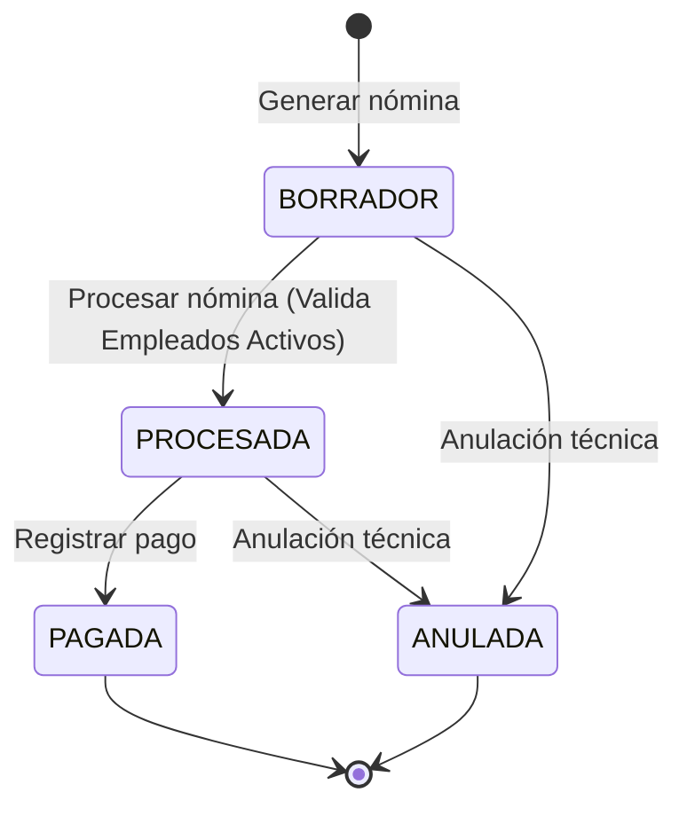

# Documento de Especificación de Requerimientos y Criterios de Aceptación (DERCAS) / SRS - Final

Este documento detalla la especificación de requerimientos funcionales y no funcionales, reglas de negocio y flujos de estado del sistema de **Gestión de Recursos Humanos (MVP)**, adaptado a los estándares de desarrollo con Next.js, Supabase y PostgreSQL.

---

## 1. Introducción
El módulo de **Gestión de Recursos Humanos** es el componente central del sistema ERP para la administración de personal, procesamiento de nómina, control de asistencia, y flujos de reclutamiento y onboarding de nuevos colaboradores.

### 1.1 Propósito
Este documento sirve como la especificación formal final del software para validación académica y de desarrollo, asegurando la trazabilidad entre el problema de negocio y el código fuente del MVP.

### 1.2 Alcance
El sistema automatiza:
*   Ciclo de vida del empleado (registro, asignación de jefe, estatus laboral).
*   Procesamiento transaccional de la nómina con desglose de bonos, deducciones y retenciones.
*   Control de asistencia e inasistencia.
*   Aprobación/Rechazo justificado de solicitudes de ausencia.
*   Ciclo de atracción y contratación (reclutamiento, selección masiva, y onboarding).

---

## 2. Requerimientos del Sistema

### 2.1 Requerimientos Funcionales (RF)
*   **RF-01**: Registrar, consultar, modificar y desactivar empleados de forma segura.
*   **RF-02**: Procesar de manera centralizada la nómina de empleados activos.
*   **RF-03**: Calcular deducciones, retenciones de ley y bonificaciones por colaborador.
*   **RF-04**: Administrar procesos de reclutamiento (apertura de vacantes, etapas).
*   **RF-05**: Iniciar y controlar de manera automatizada programas de onboarding para personal contratado.
*   **RF-06**: Registrar horarios de entrada, salida, horas trabajadas y ausencias de forma diaria.
*   **RF-07**: Gestionar solicitudes de permisos, vacaciones y ausencias por empleado.
*   **RF-08**: Registrar evaluaciones de desempeño periódicas.
*   **RF-09**: Administrar planes de capacitación y verificar asistencia.
*   **RF-10**: Administrar el catálogo y asignación de beneficios y compensaciones.
*   **RF-11**: Portal del empleado para consulta de perfil, recibo de nómina, asistencias e inscripción a capacitaciones.
*   **RF-12**: Generar reportes analíticos de rotación, deserción laboral y retención de talento.
*   **RF-13**: Validar de manera automática el cumplimiento normativo laboral vigente.
*   **RF-14**: Exportar reportes generales de asistencia, nómina y beneficios en formatos imprimibles o estructurados.

### 2.2 Requerimientos No Funcionales (RNF)
*   **RNF-01**: Autenticación y registro de sesiones seguras mediante Supabase Auth.
*   **RNF-02**: Control de acceso basado en roles (RBAC: `ADMIN_RRHH`, `JEFE_INMEDIATO`, `RECLUTADOR`, `EMPLEADO`).
*   **RNF-03**: Tiempos de respuesta óptimos (menos de 2 segundos en carga de tablas principales).
*   **RNF-04**: Arquitectura modular orientada a servicios en TypeScript (Repository Pattern).
*   **RNF-05**: Trazabilidad completa mediante bitácora de auditoría histórica para operaciones CRUD y cambios de estado.
*   **RNF-06**: Encriptación y protección de datos salariales/personales confidenciales.
*   **RNF-07**: Preparación para respaldos automáticos y recuperación ante desastres en base de datos PostgreSQL.
*   **RNF-08**: Interfaz de usuario responsive, responsiva y premium con soporte multi-dispositivo y HSL Color Tailoring.
*   **RNF-09**: Gestión inteligente de estados de error, estados vacíos (`EmptyState`) y cargando (`LoadingState`).
*   **RNF-10**: Código mantenible, limpio y modular con tipado estricto en TypeScript.

---

## 3. Reglas de Negocio (RN)

### RN-01: Estado y Configuración de Empleados
Todo empleado debe contar con un código identificador único (e.g. `EMP-XXXX`). Su salario base debe ser mayor o igual a cero y el correo debe ser único a nivel global del sistema.

### RN-02: Integridad y Estados de Nómina
El flujo de estados de una nómina es: `BORRADOR` ➔ `PROCESADA` ➔ `PAGADA`. 
*   No se puede procesar una nómina sin detalles asociados.
*   Solo se permite recalcular y modificar importes (deducciones, bonos) si la nómina está en estado `BORRADOR`.
*   El procesamiento cambia de manera irrevocable el estado de la nómina a `PROCESADA`. Una nómina `PROCESADA`, `PAGADA` o `ANULADA` no puede modificarse.

### RN-03: Cálculo Neto de Nómina
El salario neto a pagar se calcula en base a la fórmula:
$$\text{salario\_neto} = \text{salario\_base} + \text{bonificaciones} - \text{deducciones} - \text{retenciones}$$
Ninguno de los montos individuales puede ser menor a cero, ni tampoco el neto resultante.

### RN-04: Gestión de Ausencias y Aprobaciones
*   La fecha de finalización de una ausencia no puede ser inferior a la fecha de inicio.
*   Las solicitudes inician en estado `PENDIENTE`.
*   Únicamente un `JEFE_INMEDIATO` o `ADMIN_RRHH` puede aprobar o rechazar la solicitud, indicando de forma obligatoria las observaciones (en caso de rechazo, el motivo es obligatorio).
*   Solo se permite procesar solicitudes en estado `PENDIENTE`.

### RN-05: Flujo de Reclutamiento y Contratación Automatizada
Al seleccionar a un candidato de un proceso de vacante activo:
1.  El candidato pasa a estado `SELECCIONADO`.
2.  El proceso de reclutamiento asociado se cambia a `CERRADO`.
3.  Los demás candidatos vinculados a dicho proceso cambian automáticamente a `RECHAZADO`.
4.  Se genera un registro de `empleado` activo y se asocia a un programa de `onboarding` en estado `PENDIENTE`.

---

## 4. Criterio INVEST Aplicado a Requerimientos

| Requerimiento | I (Independiente) | N (Negociable) | V (Valioso) | E (Estimable) | S (Small - Pequeño) | T (Testable) |
| :--- | :--- | :--- | :--- | :--- | :--- | :--- |
| **RF-02 (Nómina)** | Sí. No depende de otros flujos directamente. | Sí. Los tipos de deducción son variables. | Sí. Automatiza el pago. | Sí. Definido por el cálculo matemático. | Sí. Dividido en cabecera y detalles. | Sí. Comprobable mediante operaciones matemáticas. |
| **RF-07 (Ausencias)**| Sí. Es autocontenido. | Sí. Los tipos de permisos pueden variar. | Sí. Evita traslapes. | Sí. Definido en días. | Sí. Alta, Listado y Aprobación. | Sí. Validando rango de fechas y estados. |
| **RF-04 (Selección)**| Sí. Modular con onboarding. | Sí. Las etapas son dinámicas. | Sí. Reduce tiempos de contratación. | Sí. Estructurado por máquina de estados.| Sí. Vinculación, Etapa y Contratación. | Sí. Evaluando el alta del empleado en la DB. |

---

## 5. Estados del Flujo y Supuestos Técnicos

### 5.1 Flujos de Estado principales

### 5.2 Supuestos Técnicos y Restricciones
*   **Supuesto**: Se asume que el usuario autenticado tiene su rol asignado en la metadata del usuario de Supabase Auth para poder validar las políticas RLS.
*   **Restricción**: El salario neto de los colaboradores no puede ser negativo bajo ninguna circunstancia, provocando un error controlado de backend/frontend si las deducciones exceden el salario base más bonificaciones.
