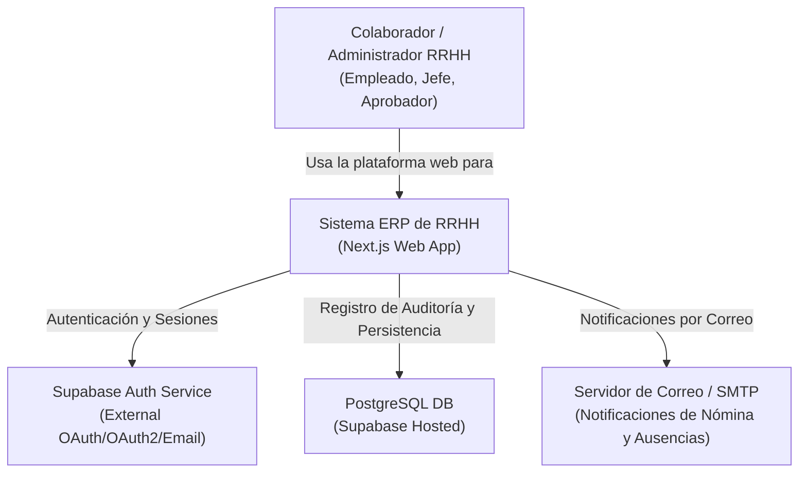
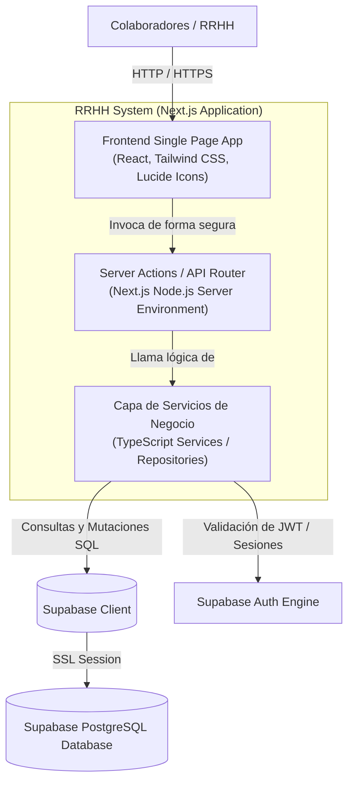
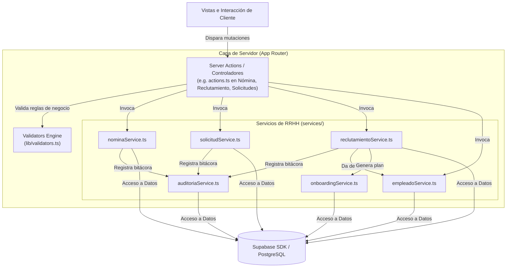

# Diagrama y Modelo C4 del Sistema

Este documento describe la arquitectura de software del sistema de **Gestión de Recursos Humanos** mediante el modelo C4 (Contexto, Contenedor y Componente) utilizando diagramas de bloques Mermaid.

---

## 1. Nivel 1: Diagrama de Contexto de Sistema
Define el alcance del sistema y cómo interactúan los usuarios con él y con sistemas externos.

---

## 2. Nivel 2: Diagrama de Contenedores
Muestra la composición tecnológica detallada del sistema RRHH.

---

## 3. Nivel 3: Diagrama de Componentes
Detalla la estructura interna de la capa de backend de Next.js (`Server Actions` y `Services`) y su comunicación con la base de datos PostgreSQL.

---

## 4. Mapeo de Contenedores a Código Fuente
*   **Frontend SPA (React)**: Ubicado en `src/app/` (vistas e interacciones del cliente con componentes dinámicos e interactivos en TypeScript).
*   **Server Actions**: Implementado en archivos `actions.ts` dentro de cada módulo en `src/app/dashboard/`.
*   **Capa de Servicios / Repositorios**: Ubicado en `src/services/` (`nominaService.ts`, `solicitudService.ts`, `reclutamientoService.ts`, `auditoriaService.ts`).
*   **Persistencia (PostgreSQL)**: Definido en las tablas y triggers del esquema SQL en `supabase/migrations/001_initial_schema.sql`.
