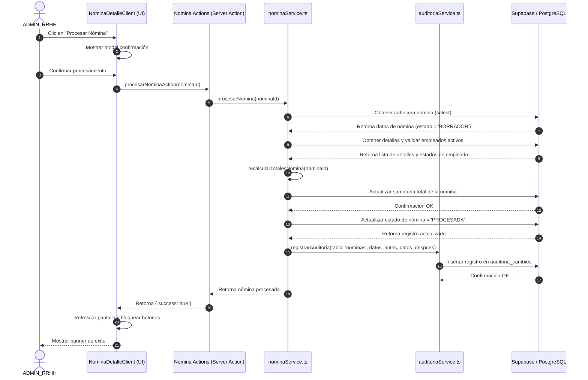
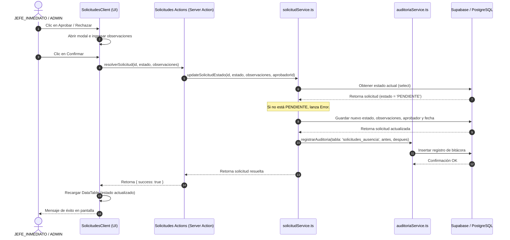
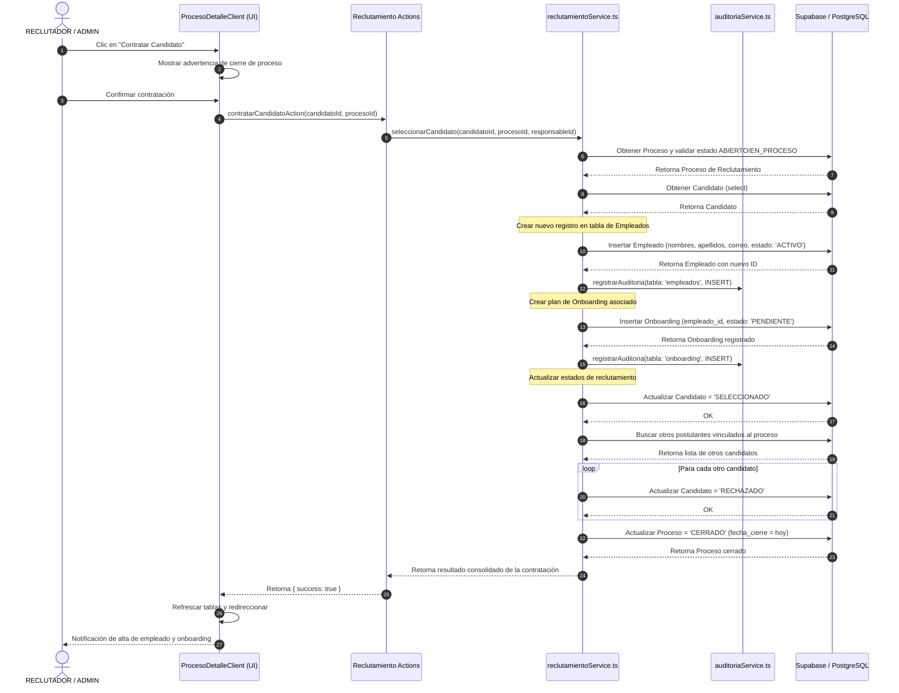

# Diagramas de Secuencia del Backend

Este documento detalla los flujos de comunicación y llamadas entre el frontend (UI), las Server Actions, los Servicios en TypeScript y la base de datos PostgreSQL/Supabase para los tres procesos transaccionales críticos.

---

## 1. Procesamiento de Nómina (CU-01)
Muestra cómo se valida, recalcula y bloquea una nómina.

---

## 2. Aprobación o Rechazo de Solicitud de Ausencia (CU-02)
Muestra el control de estado para evitar reprocesos y guardar justificaciones.

---

## 3. Contratación Automática desde Reclutamiento (CU-03)
Muestra la creación transaccional de empleado y onboarding al contratar un candidato.

